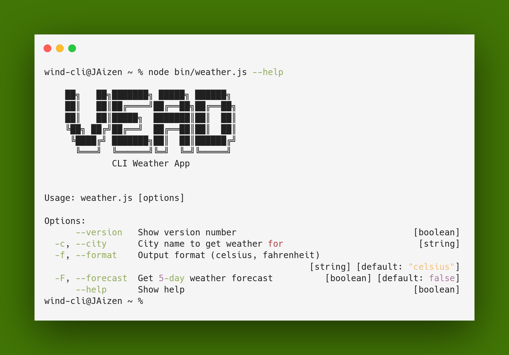

# VEAD, a Weather CLI App



A simple cli for checking weather conditions worldwide

## Features

- Check current weather conditions for any city
- View 3-day weather forecast
- Support for both Celsius and Fahrenheit units
- Simple and intuitive command-line interface

## Installation

1. Clone or download VEAD
2. Install dependencies:
   ```bash
   yarn install
   ```

## Setup

To use VEAD, you need to get a free API key from [WeatherAPI](https://www.weatherapi.com/):

1. Visit [https://www.weatherapi.com/signup.aspx](https://www.weatherapi.com/signup.aspx) and create a free account
2. Get your API key from [https://www.weatherapi.com/my/](https://www.weatherapi.com/my/)
3. Set the API key as an environment variable:
   ```bash
   export WEATHER_API_KEY="your_api_key_here"
   ```

## Usage

### Basic Usage
```bash
node bin/weather.js --city "New York"
```

### Options

- `-c, --city` (required): Name of the city to get weather for
- `-f, --format` (optional): Temperature format (`celsius` or `fahrenheit`, default: celsius)
- `-F, --forecast` (optional): Get 3-day weather forecast

### Examples

Get current weather in New York:
```bash
node bin/weather.js --city "New York"
```

Get current weather in Fahrenheit format:
```bash
node bin/weather.js --city "London" --format fahrenheit
```

Get 3-day forecast for Tokyo:
```bash
node bin/weather.js --city "Tokyo" --forecast
```

Get forecast in Fahrenheit format:
```bash
node bin/weather.js --city "Sydney" --forecast --format fahrenheit
```
